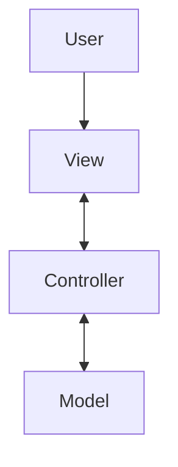
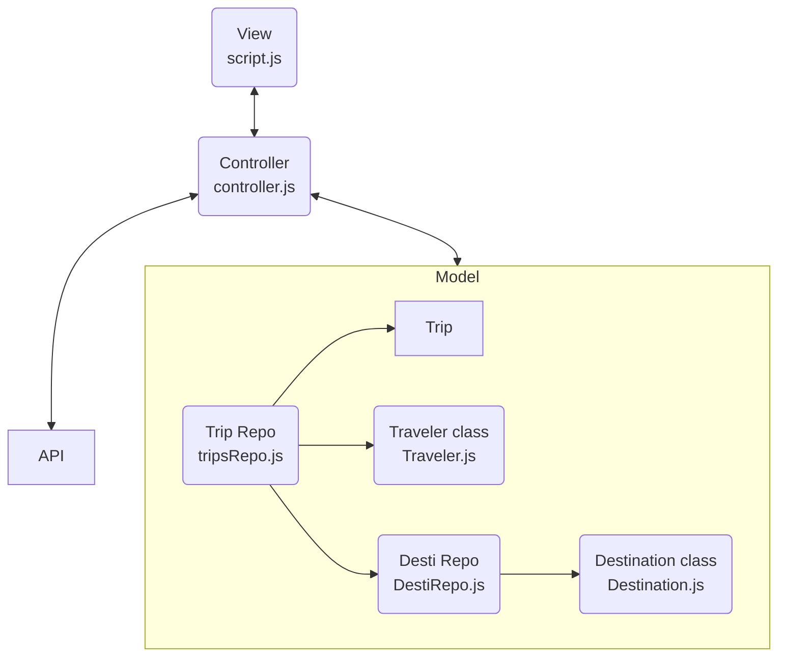

##Understanding MVC

I was introduce to MVC pattern during the beginning of Turing, while the focus was to write everything only in vanilla javascript. MVC is an acronym for Model View Controller where, Model represents the business logic or what make the application, View is what user interact with and Controller is the bridge between the Model and View. 

On top of MVC pattern, I also employed Repository pattern for managing data within Model.A Repository mediates between the domain and data mapping layers, acting like an in-memory domain object collection. In my case, I use class instance to construct a data object and repository to store a compilation of data. 

## How I use MVC in my project

I used the MVC pattern while building a trip-booking application called Travel tracker. I found that because the Model returns the data, it allows the same component to be reused. This concept makes the code modular, which means the modification of a function doesn't affect the entire model, since the model doesn't depend on the views. The approach also limits the amount of code duplication since the View is separated from the data and business logic.
On top of the MVC pattern, I also employed the Repository pattern for managing data within the Model.  A repository mediates between the domain and data mapping layers, acting like an in-memory domain object collection. In my case, I use a class instance to construct a data object and repository to store a compilation of data. 
Using the repository pattern separates data access from business logic. Some of the benefits are centralization of the data access logic makes code easier to maintain. This approach allows business and data access logic to be tested separately, helps reduce duplication of code, and lowers the chance of making programming errors. 

## Challenges and Success

Before being introduced to the MVC, my Dom elements doesn’t separate from my data model functions. With a prior frame of thought,  I had to refactor many of the codes to fit with the MVC pattern. For example, I wrote a function in the controller file using DOM elements. What I should have done is write a function in the View file to call a controller function that returns value to manipulate DOM elements.
Another challenge is to be comfortable with having many small files. Having a small amount of code in many files created a clear structure that makes it easier to navigate. This also minimized the chance of accidentally changing other codes unintentionally. 
My win for this implementation is I have a better sense of focusing on the purpose of the function and concept of single responsibility.

