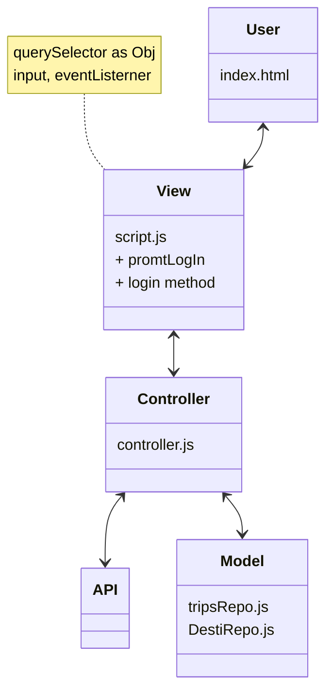
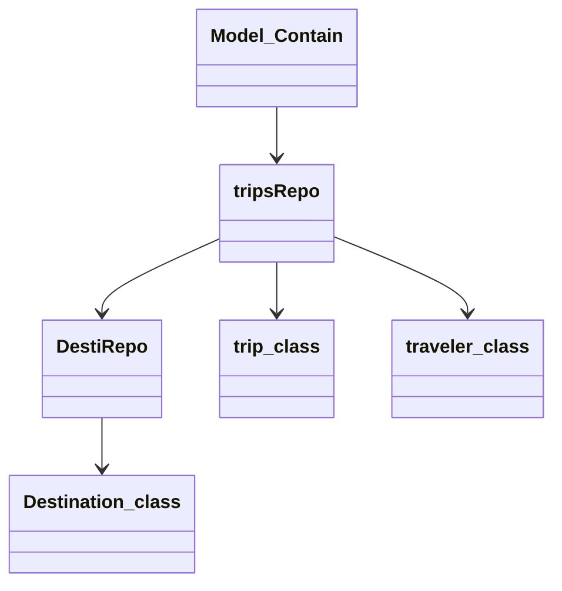

## Vanilla JS VS MVC

I was introduce to MVC pattern during the beginning of Turing, while the focus was to write everything only in vanilla javascript. MVC is an acronym for Model View Controller where, Model represents the business logic or what make the application, View is what user interact with and Controller is the bridge between the Model and View. 

On top of MVC pattern, I also employed Repository pattern for managing data within Model.A Repository mediates between the domain and data mapping layers, acting like an in-memory domain object collection. In my case, I use class instance to construct a data object and repository to store a compilation of data. 

## How I use MVC in my project

I used MVC pattern in while building a trip booking application called Travel tracker. I found that because Model returns the data, it allows the same component to be reused. This concept make the code modular, which means modification of a function doesn't efffect the entire model.  Since the model doesnt depend on the views. The approach also limits the amount of code duplication since the view is separated from the data and business logic.

Using repositiory pattern separate data access from business logic. Some of the banefit I found are centralization of the data access logic makes code easier to maintain. Business and data access logic can be tested separately. It helps reduces duplication of code and also lower chance for making programming errors.

## Challenges and Success

I ended up having to refactor a lot of the codes to fit with MVC pattern. For example, I wrote a function in the controller file that using DOM elements. What I should have done is writing a function in the VIEW file to call a controller function that return value to manipulate DOM elements.
Another challenge is be comfortable of having many small files.
My win for this implementation is I have a better sense of focusing on the purpose of the function and concept of single responsibility
