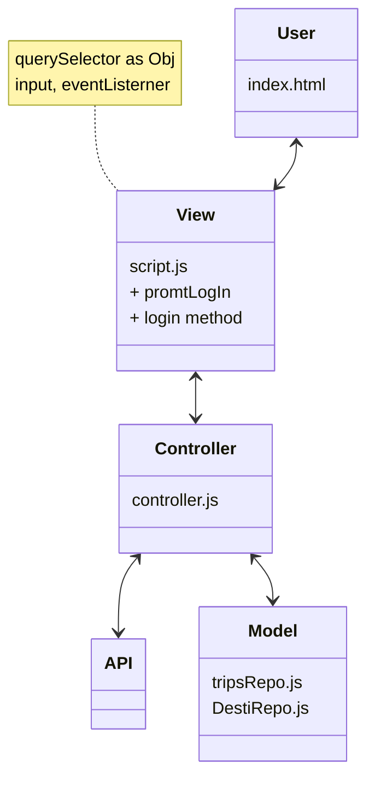
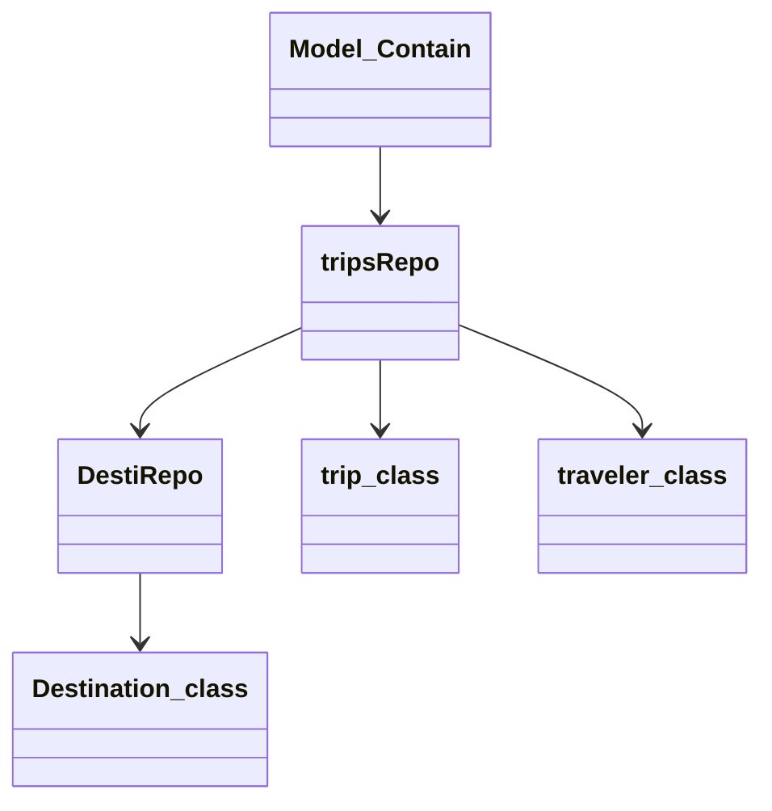

---
title:MVC MVP
---

## Vanilla JS VS MVC

I was introduce to MVC pattern during the beginning of Turing, while the focus was to write everything only in vanilla javascript. MVC is an acronym for Model View Controller where, Model represents the business logic or what make the application, View is what user interact with and Controller is the bridge between the Model and View.

## How I use MVC in my project

I used MVC pattern in while building a trip booking application called Travel tracker. On top of MVC pattern, I also employed Repository pattern for managing data.

## Challenges and Success

I ended up having to refactor a lot of the codes to fit with MVC pattern. For example, I wrote a function in the controller file that using DOM elements. What I should have done is writing a function in the VIEW file to call a controller function that return value to manipulate DOM elements.
Another challenge is be comfortable of having many small files.
My win for this implementation is I have a better sense of focusing on the purpose of the function and concept of single responsibility
