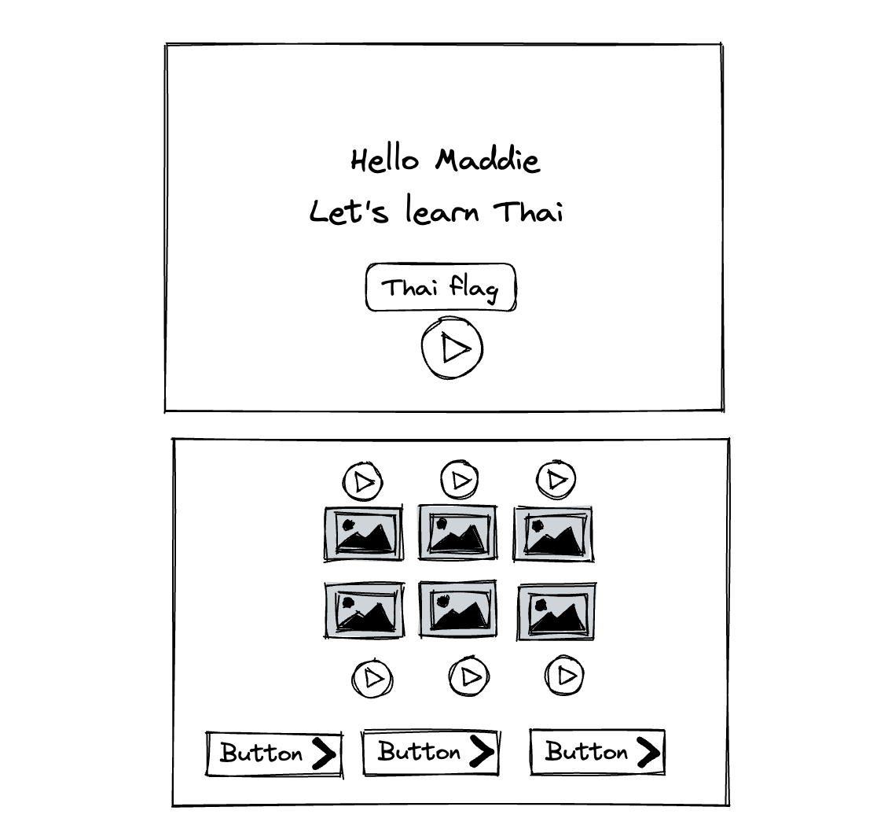

# Thai Word Game Journal

My first language is Thai, and I want to create a simple webapp word game to play with my four years old.

## Day 1

#### Task 1 writing out user story

These are first iteration users story
As a user -

1. when I visit the site, I can see the game description and hear the greeting message
2. I can start the game from landing page
3. when the game start, I can click image tiles and it will play the name of the image in Thai.

#### Task 2 UI wire frame

[UI Wire Frame](https://excalidraw.com/#json=SOM85H-29YGUNFU6atZI6,AfqFty9PlsO5-V41baM6qA)

