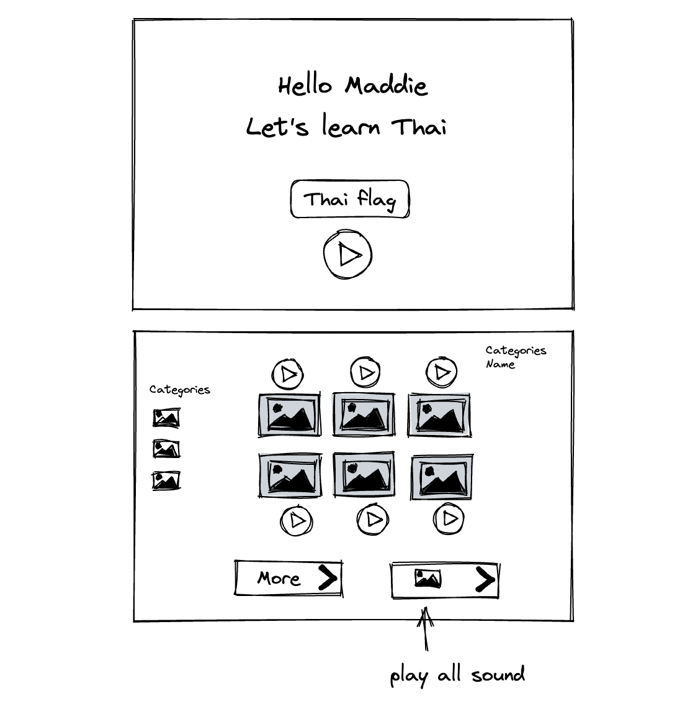
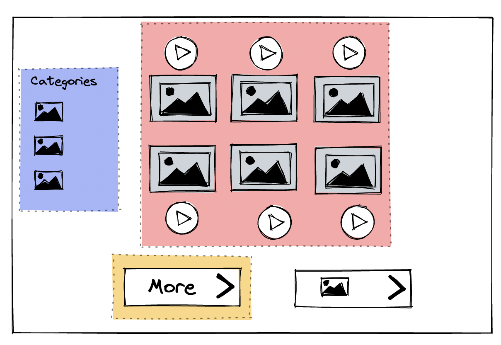

# Thai Word Game Phase I

My first language is Thai, and I want to create a simple webapp word game to play with my four years old. I watched my daughter played with a stuffed animal that when she press a button, it'd say random words and she'd keep repeating them over and over. I though it would be fun to create a similar UI web application that my daughter can simply press a button tha play words in Thai that she can repeat.

#### Task 1 UI wire frame

[UI Wire Frame](https://excalidraw.com/#json=SOM85H-29YGUNFU6atZI6,AfqFty9PlsO5-V41baM6qA)

Because it will be for a small child, the image and buttons would be fairly large. The layout will be simple with minimal color contrast and easy to understand images.

#### Task 2 Breaking work down : color blocks

I am very excited to see this app in action that led me to breaking task down in the way that I can deliver value quickly. For the app to be able to have the most basic function, I need to create the component in the red area first. The red box include the UI components and the backend server with single table to support the minimum required data.  

The next step is to write user story, creating React architecture and backend server and database. My intend is to build this application in public. Stay tune for more post!

"This is a my new idea for an app that I intent to build in public, It's an app to help my 3 year old learn Thai! follow along as I build it!
