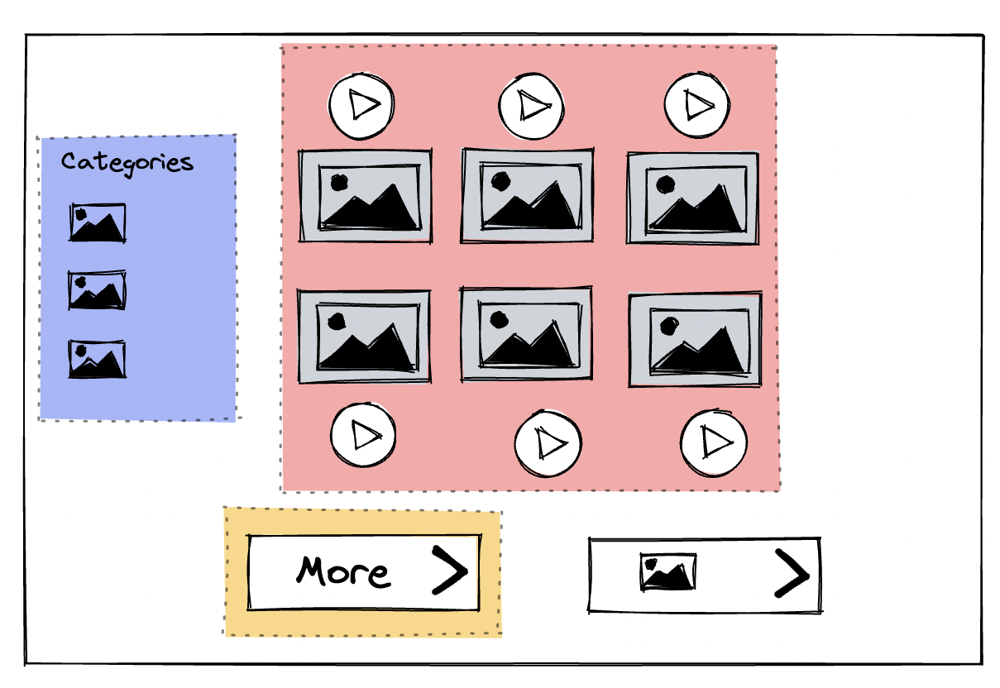

# Thai Word Game Phase II

#### Task 1 writing out user story for the red box MVP

These are first iteration users story - red box
**As a user -**

1. when I visit the site, I can see the game description and hear the greeting message
2. I can start the game from landing page
3. when the game start, I can click image tiles and it will play the name of the image in Thai.

In order to deliver value quickly, I want to create the backend which include the server and the database. The data at this point would be a fairly simple, a voice record associate to the a few words. I can achieved that with a single table in a database. From there, spin up an API and server should be straightforward. I want to use PARN stack for this project because I want stay with 1 language and JSON structure. My voice record will be store in google drive for now.

### does it work the way I plan, struggle and challenge?

Second - Yellow box

As a user,
I can generate another set og words with a click of a button

Third - Blue box

As a user
I can see different word ps because with involve more data. I need to create a function that filter word using a category and an ability to go back adn forth between filter and not filter.
